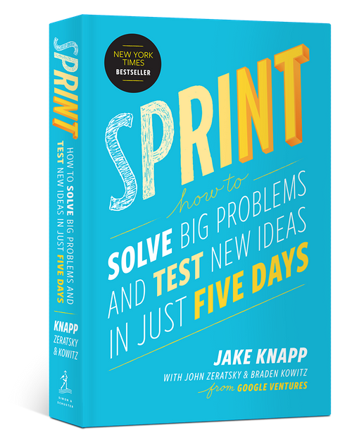

# books i liked (will be fleshed out later!)

[SPRINT](https://www.thesprintbook.com/)

This book is what made me get over the fear of starting projects. Made by one of the core developers of Gmail, 
it focuses on what some of the most popular and beloved software companies 

[Enshittification](https://shop.craphound.com/)

Im not doing it justice by a short blurb, but this book really shocked me. super entertaining and really eye opening.

